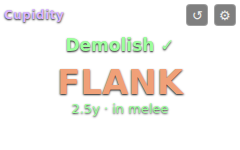
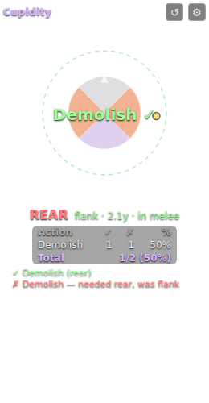

# Cupidity

**Avarice-style positional feedback for FFXIV — fully external, the cactbot way.**

Cupidity gives melee players live rear/flank tracking and per-skill positional
hit/miss feedback, like the [Avarice](https://puni.sh/plugin/Avarice) Dalamud
plugin — but it never touches the game process. It is a plain web overlay for
[ACT](https://advancedcombattracker.com/) +
[OverlayPlugin](https://github.com/OverlayPlugin/OverlayPlugin), exactly like
[cactbot](https://github.com/OverlayPlugin/cactbot): no injection, no Dalamud,
no plugins inside the game.

<p align="center">&nbsp;&nbsp;</p>

## Features

- **Simple mode (default)** — just a big **REAR / FLANK** readout with the
  distance line and ✓/✗ hit flash. Untick *Simple mode* in ⚙ for the full
  radar + stats view, or force a mode per overlay instance with
  `?simple=1` / `?simple=0` in the URL.
- **Anticipated positional** — the big word is the positional you need
  *next* (green when you're standing in it), using the same per-job rules
  as Avarice, rebuilt from log-trackable state: combo chain (SAM
  Jinpu/Shifu, DRG combo branches, NIN Gust Slash, VPR stings), gauge
  counters (MNK Coeurl's Fury, NIN Kazematoi), and statuses (RPR Soul
  Reaver/Executioner + Enhanced Gibbet/Gallows, SAM Meikyo + Sen, VPR
  venoms and the Vicewinder coil chain, NIN Trick Attack/Kunai's Bane).
  When nothing is anticipated the big word is hidden — your current sector
  always shows in the small range line.

- **Live positional radar** — target-relative view with front/flank/rear
  quadrants, your position, target facing, and a max-melee range ring with
  distance readout. Updates ~10×/s from OverlayPlugin combatant data.
- **Positional hit/miss feedback** — every use of a positional weaponskill
  (MNK, DRG, NIN, SAM, RPR, VPR) flashes ✓/✗ on screen, with an optional
  miss sound and a scrolling event feed.
- **Accurate detection, not guesswork** — resolved from the ability packet
  itself (see [How it works](#how-it-works)), not from screen-side polling.
- **True North aware** — uses of positionals under True North always count
  as hits, matching the game.
- **Per-encounter stats** — hit/miss counts and percentages per action,
  reset on zone change or manually.
- **Configurable** — hitbox radius, melee reach, radar mirroring, sounds,
  feed visibility. Settings persist per overlay.

## Installation

1. Install [ACT](https://advancedcombattracker.com/) with the FFXIV parsing
   plugin and [OverlayPlugin](https://github.com/OverlayPlugin/OverlayPlugin)
   (the modern combined installer sets up both — same prerequisites as
   cactbot).
2. In ACT: **Plugins → OverlayPlugin.dll → New** ("+" button):
   - Preset: *Custom overlay*
   - Type: *MiniParse*
   - URL: `https://meowmeowmeowie1.github.io/Cupidity/overlay/index.html`

   (Or clone the repo and use the local path to `overlay/index.html`
   instead — works offline and with local edits.)
3. Position and resize the overlay while it is unlocked (it shows a dashed
   outline), then lock it. Hover the overlay to reach the ⚙ settings and ↺
   stats-reset buttons.

You can also run it in a normal browser through OverlayPlugin's WSServer:
start the WSServer in OverlayPlugin's config, then open
`overlay/index.html?OVERLAY_WS=ws://127.0.0.1:10501/ws`.

### Try it without the game

Open `overlay/index.html?demo=1` in any browser for an animated demo with a
fake target and fake positional results.

## How it works

Everything comes from data ACT already exposes, the same sources cactbot
uses:

1. **Ability lines (log line 21/22).** Each use of a weaponskill carries, in
   the packet itself: both actors' **server-snapshot positions and headings**,
   and a flags byte with the **percent of final damage contributed by
   positional/combo bonuses** (the same `+61%` you see in the in-game battle
   log). See cactbot's
   [LogGuide](https://github.com/OverlayPlugin/cactbot/blob/main/docs/LogGuide.md).
2. **Hit/miss resolution**, in order of precedence:
   - **True North** active on you → hit (the game waives facing).
   - For skills whose *only* potency bonus is the positional (e.g. Snap
     Punch, Demolish, Fang and Claw, Wheeling Thrust), the server's
     bonus-percent byte is exact: `>0%` ⟺ positional hit.
   - Otherwise (combo bonuses or status-conditional potency would pollute
     that byte — SAM, NIN, RPR, VPR), the packet's own positions and headings
     decide geometrically. These are the values the snapshot was taken with,
     not a client-side poll.
3. **The radar** polls `getCombatants` ~10×/s for your and your target's
   live position/heading, via the target from `EnmityTargetData`.

## Configuration notes

- **Hitbox radius**: enemy hitbox size is not exposed to external tools (the
  one real limitation vs. a Dalamud plugin), so the radar ring radius is a
  setting. 5y fits most raid bosses; ~2y suits dummies and trash. Detection
  accuracy does **not** depend on this — only the radar drawing does.
- **Mirror radar**: flips left/right if the side display feels backwards to
  you.

## Updating for new patches

All positional skills live in
[`overlay/js/data.js`](overlay/js/data.js) — one line per action with its
required quadrant. When a patch adds/removes positionals, edit that table;
no other code changes are needed. Entries marked `verify: true` carry action
IDs sourced from community references that haven't been confirmed against a
live log yet — matching falls back to the English action name, so they work
on EN clients regardless.

## Development

Pure static files, no build step. The parsing/math core is dependency-free
and tested against real log lines from the cactbot LogGuide:

```
node test/core.test.js
```

## Differences from Avarice

| | Avarice (Dalamud) | Cupidity (external) |
|---|---|---|
| Runs | inside the game process | in ACT's overlay browser |
| Drawing | in-world, on the actual hitbox | screen-space radar |
| Hitbox radius | read from memory | configurable estimate (radar only) |
| Positional detection | game hooks | packet data (bonus % + snapshot geometry) |

## Disclaimer

Cupidity is a third-party tool in the same category as ACT, OverlayPlugin
and cactbot. Use at your own discretion under Square Enix's terms of
service. Not affiliated with Square Enix or with Puni.sh — name and concept
are a homage to Avarice.
